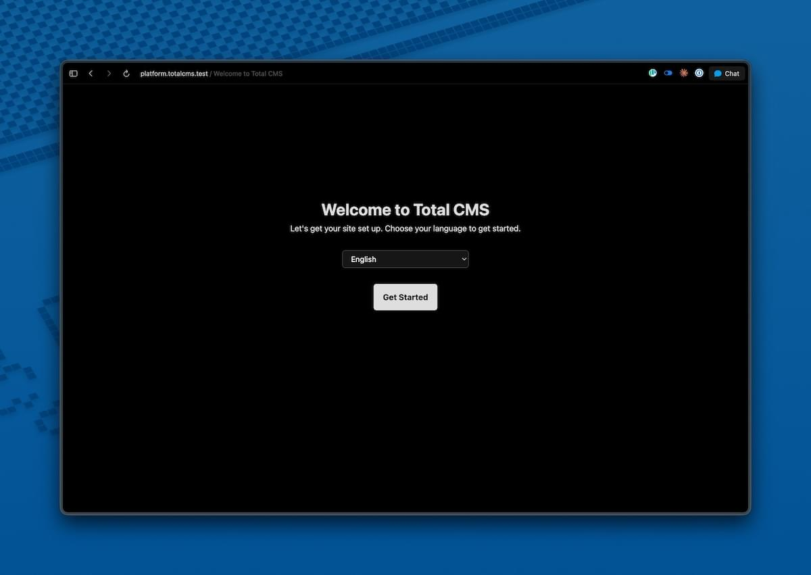
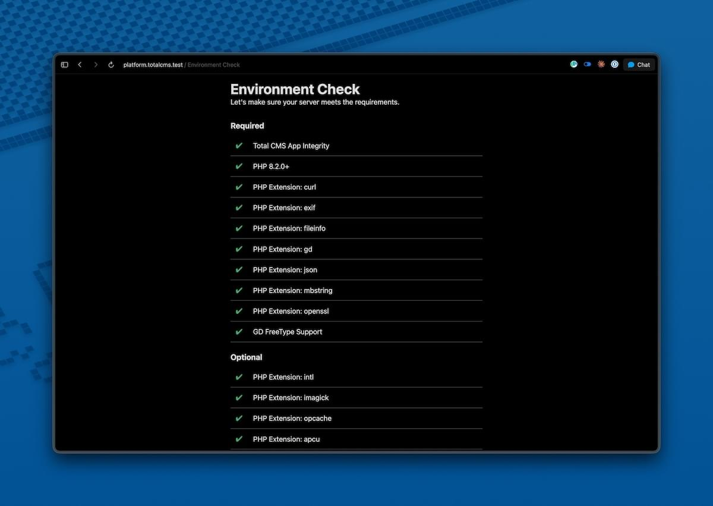
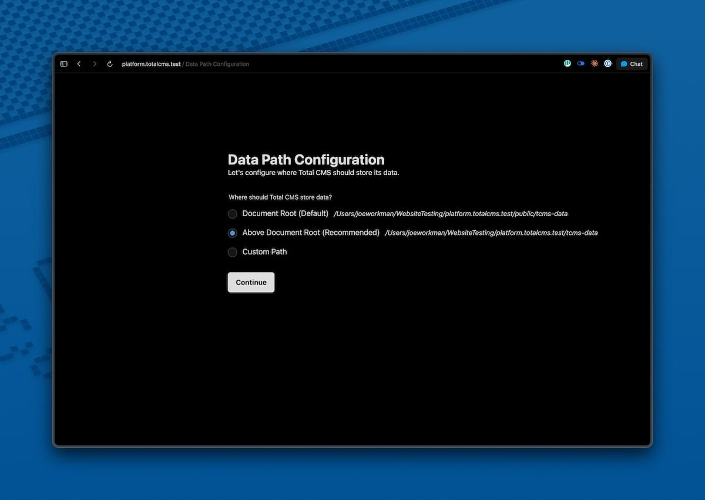
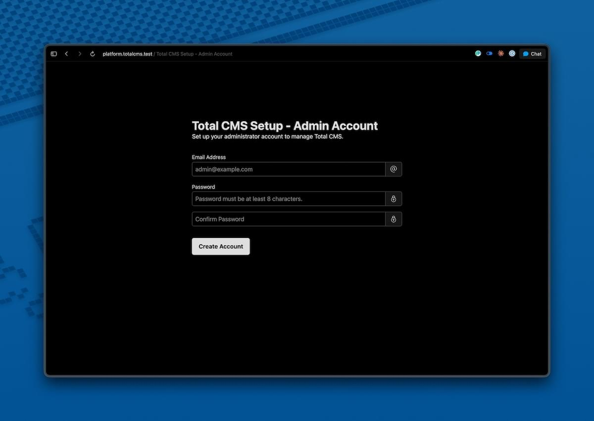
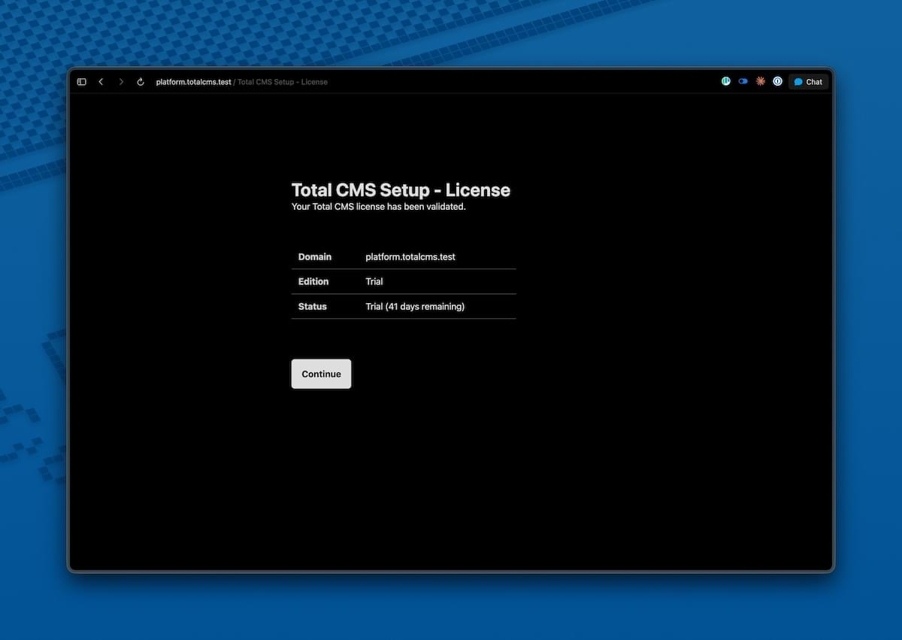
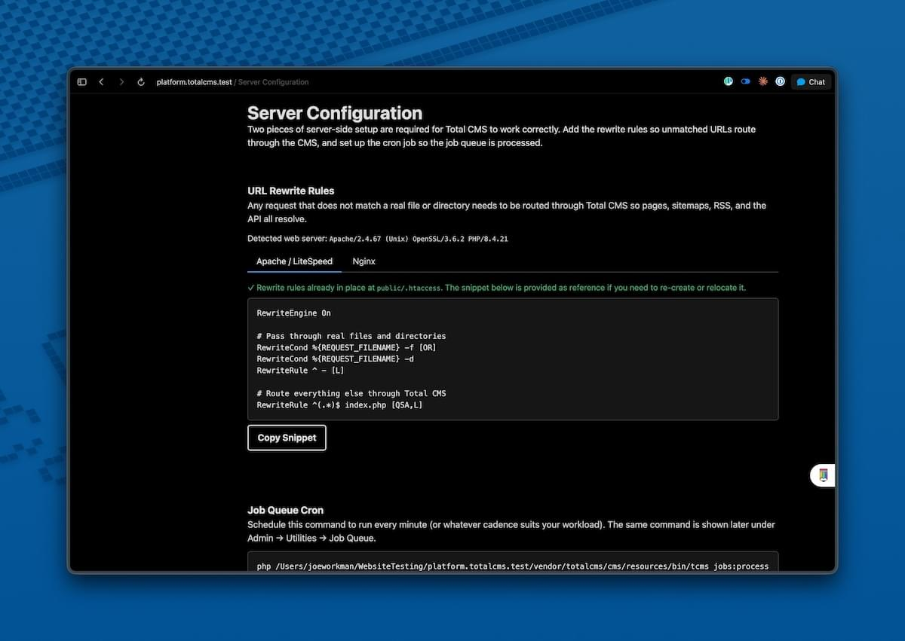

You'll be up and running in under 5 minutes. The setup wizard handles everything after the initial command.

## Composer install (recommended)

```bash
composer create-project totalcms/totalcms my-site --stability=beta
```

> **Beta note:** The `--stability=beta` flag is required while 3.5 is in beta. Drop it once 3.5 stable ships.

This downloads Total CMS into `my-site/`, then runs a short post-install script that asks you a few setup questions. Make sure your server meets the [System Requirements](/get-started/requirements/) before installing.

### What the install asks

After Composer finishes downloading, you'll be prompted with up to three questions.

#### 1. Layout

Where T3 lives in your URL space.

| Choice | What it does | Pick this if… |
|---|---|---|
| **root** (default) | T3 owns the whole domain. Front controller at `public/index.php`; requests go to T3 by default | T3 is your whole site |
| **subpath** | T3 lives at `/tcms/`. `public/` is free for your own frontend build | You're using T3 as a headless CMS alongside a separate frontend (Next.js, Astro, static, etc.) |

Picking `subpath` moves `public/index.php` and `public/.htaccess` into `public/tcms/` automatically.

#### 2. Starter pack *(root layout only)*

A starter pre-seeds your install with sample pages and content so you have something to look at right away. Bundled starters:

| Starter | What you get |
|---|---|
| minimal | A blank canvas. Empty page tree, no demo content |
| blog | Blog homepage, post layout, sample posts |
| business | Homepage with sections, about page, contact form |
| portfolio | Project gallery layout with sample entries |

Pick `none` if you want a fully empty install. You can run `tcms builder:init <starter>` later to apply one.

#### 3. Frontend pipeline *(root layout only)*

A Vite-based bundle for compiling your site's CSS and JS, drops a `frontend/` directory at the project root that you can `npm install` into. Builder layouts can reference compiled assets via `{{ cms.builder.css(...) }}`.

Default: **no**. You can add it later with `tcms builder:frontend`.

### After the install

1. Point your web server's document root to `my-site/public/`
2. Visit your site in a browser:
   - Root layout: visit `/`
   - Subpath layout: visit `/tcms/`

The setup wizard starts automatically.

### Non-interactive installs

For CI or scripted installs, set environment variables and the prompts use those instead of asking:

| Variable | Values | Default |
|---|---|---|
| `TCMS_LAYOUT` | root &#124; subpath | `root` |
| `TCMS_STARTER` | none &#124; minimal &#124; blog &#124; business &#124; portfolio | `none` |
| `TCMS_FRONTEND` | 0 &#124; 1 | `0` |

```bash
TCMS_LAYOUT=root TCMS_STARTER=blog TCMS_FRONTEND=1 \
  composer create-project totalcms/totalcms my-site --stability=beta --no-interaction
```

## Alternative: zip download

If Composer isn't available — shared hosting, restricted environments, or you just prefer file uploads — install from a zip:

1. Download the Total CMS zip from [totalcms.co](https://totalcms.co)
2. Extract it to your server
3. Point your web server's document root at the extracted `public/` directory
4. Visit your site — the setup wizard starts automatically

The zip workflow is otherwise identical to Composer: same wizard, same admin, same update flow.

## Setup wizard

When you first visit your install URL, the wizard runs through these screens.

### 1. Welcome

Choose your preferred language for the admin interface:

| Code | Language |
|---|---|
| `en_US` | English (US) |
| `en_GB` | English (UK) |
| `de_DE` | Deutsch |
| `es_ES` | Español |
| `nl_NL` | Nederlands |

> This setting only affects the admin. Your public-facing site uses its own translations.



### 2. Environment check

The wizard verifies your server meets the [System Requirements](/get-started/requirements/). All required PHP extensions must pass; recommended ones show as suggestions.

If something's missing, you'll see exactly what to install. Fix it, refresh, and the check re-runs automatically.



### 3. Data path

Choose where Total CMS stores your content. This directory is **separate from the application** — updates never touch your content.

| Option | Path | When to choose |
|---|---|---|
| Document Root | `<docroot>/tcms-data` | Simplest. Works on every host |
| Above Document Root | `<parent>/tcms-data` | Recommended for production — keeps content outside the web tree |
| Custom Path | Any absolute path | When the defaults don't fit your hosting setup |

If the data directory ends up inside your docroot, T3 drops an `.htaccess` in it that blocks direct web access.



### 4. Admin account

Create your first administrator account. You'll log in with these credentials every time.

This account has full privileges, including installing extensions and modifying schemas — pick a strong password.



### 5. License

Your license is validated automatically. New installations start with a free trial; if you've already purchased a license for this domain, it's detected on first run.

You can change the license later from **Settings → License Manager** in the admin.



### 6. Server config

The wizard renders the exact rewrite-rule snippets you need for your server. For Composer installs, the Apache rules ship in `.htaccess` automatically — the wizard tells you everything's already in place. For other servers (Nginx, Caddy), copy the snippet into your server config and reload.



## You're done

After the wizard completes, you land in the admin dashboard. From here:

- Follow the [Your First Site](/get-started/your-first-site/) tutorial to add content and render it on a public page (about 10 minutes)
- Or take the [Dashboard tour](/admin/dashboard/) for an overview of the admin


## Directory structure

After installation:

```
/var/www/example.com/
├── my-site/                  # Application
│   ├── config/               # Configuration files
│   ├── public/               # Web root — point your server here
│   │   ├── index.php         # Entry point
│   │   └── assets/           # CSS, JS, images
│   ├── resources/            # Templates, schemas, translations, docs
│   ├── src/                  # PHP source
│   ├── vendor/               # Composer dependencies
│   └── version.json          # Version info
└── tcms-data/                # Your content (separate from the app)
    ├── .schemas/             # Custom schema definitions
    ├── .system/              # Settings, API keys
    ├── builder/              # Site Builder templates
    ├── templates/            # Custom Twig templates
    └── [collections]/        # Collection data (blog, gallery, etc.)
```

The application (`my-site/`) and your content (`tcms-data/`) are deliberately separate.

> **Updates only touch the application.** Your content is never affected.

## Web server configuration

Most servers work out of the box. Reference configs below.

### Apache

T3 ships an `.htaccess` for URL rewriting. Just ensure `mod_rewrite` is enabled:

```bash
sudo a2enmod rewrite
sudo systemctl reload apache2
```

A minimal virtual host:

```apache
<VirtualHost *:80>
    ServerName example.com
    DocumentRoot /var/www/example.com/my-site/public

    <Directory /var/www/example.com/my-site/public>
        AllowOverride All
        Require all granted
    </Directory>
</VirtualHost>
```

### Nginx

Nginx needs a full server block with explicit rewriting and PHP-FPM proxying. See [Nginx Configuration](/operations/nginx/) for the complete reference.

### Caddy and FrankenPHP

Both work like Nginx via PHP-FPM (or FrankenPHP's classic mode). Point them at `public/index.php` with a standard PHP fastcgi proxy and a `try_files`-style fallback for routing.

### LiteSpeed

Works out of the box using the bundled `.htaccess`. No extra config needed.

## CLI

T3 ships with a CLI tool for routine operations — collection management, JumpStart imports, cache clearing, and more:

```bash
php my-site/resources/bin/tcms info
```

See [CLI Commands](/extensions/cli/) for the full reference.

## Troubleshooting

### Setup wizard doesn't appear

Your web server is pointing at the wrong directory. T3's web root is `my-site/public/`, not `my-site/`. Update your virtual host's `DocumentRoot` and reload.

### Permission denied errors

The web server user (`www-data` on Debian/Ubuntu, `apache` on RHEL/CentOS) needs write access to:

- `tcms-data/`
- `my-site/cache/`
- `my-site/logs/`
- `my-site/tmp/`

```bash
sudo chown -R www-data:www-data tcms-data my-site/{cache,logs,tmp}
```

### Required extension missing

The wizard tells you which one. On Debian/Ubuntu:

```bash
sudo apt install php8.2-{extension}
sudo systemctl reload apache2   # or php8.2-fpm
```

Refresh the wizard — the check re-runs automatically.

### Blank page or 500 error

Check `my-site/logs/` for specific error messages. Common causes:

- PHP version below 8.2
- A required extension didn't reload after install
- File permissions on `tcms-data/` or `my-site/cache/`

### 404 on every page

URL rewriting isn't working.

- **Apache:** verify `mod_rewrite` is enabled and the virtual host has `AllowOverride All`
- **Nginx / Caddy / FrankenPHP:** check the `try_files` directive — see [Nginx Configuration](/operations/nginx/)

### License validation fails

- Verify `curl` is installed (`php -m | grep curl`)
- Confirm outbound HTTPS from the server isn't blocked by a firewall
- Make sure the domain you're installing on matches your license

## Getting help

If something's still not working:

1. Check `my-site/logs/` for specific error messages
2. Search the [Community Forum](https://community.weavers.space/total-cms)
3. Review the [Deployment Guide](/operations/deployment/) for production-specific issues
