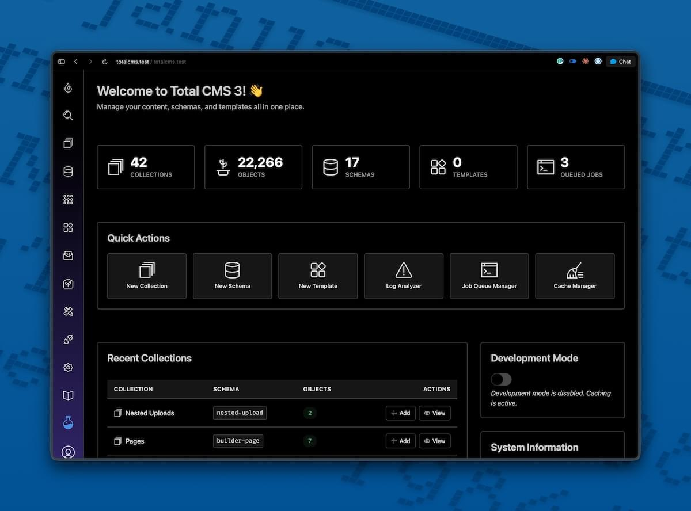

Total CMS is a flat-file PHP content management system for people who build websites — site builders, developers, agencies, freelancers. Content lives as JSON on disk, templates use Twig, and every operation in the admin is a REST endpoint.

You can run a Total CMS site on any PHP host without provisioning a database or wiring up an ORM.

## How it works

- **Content lives in flat files** — Your collections, schemas, and objects are stored as JSON on disk. No database to provision, host, or back up.
- **[Site Builder](/site-builder/overview/) publishes pages instantly** — Add a page in the admin and it's live at its URL. No build step, no deploy, no static generation.
- **[Twig templates](/twig/overview/) and a [REST API](/apis/rest-api/)** — Render content with Twig in-process for SSR, or hit the REST API from any frontend.

## How content is organized

A handful of terms come up throughout these docs:

| Term | What it is |
|---|---|
| **Object** | A single record inside a collection — one blog post, one product, one image |
| **Property** | A field on an object — title, body, date, image, etc. |
| **Schema** | The definition of what properties are contained within an object |
| **Collection** | A group of related objects that share the same schema — e.g. all your blog posts, all your gallery images |

You'll see these throughout. The [Your First Site](/get-started/your-first-site/) tutorial uses them in context.

> **Why flat-file?** Your content travels with your code. Copy a folder and you have a complete site. Back it up with `tar`. Move it between staging and production without a database dump-and-restore dance. Version-control your content alongside your templates. The database never goes down because there isn't one.

## What you'll build in 10 minutes

The fastest way to learn Total CMS is to build something with it. The [Your First Site](/get-started/your-first-site/) tutorial walks you through:

1. Installing Total CMS
2. Adding your first blog post in the admin
3. Writing a short Twig template
4. Seeing your post render on a public page

By the end, you'll have hands-on familiarity with collections, schemas, objects, the admin, the file layout, and the template engine — the foundational ideas of Total CMS, learned by doing.

[**Start the tutorial →**](/get-started/your-first-site/)

## Already installing?

If you'd rather skip the tutorial and go straight to setup:

| Step | What it covers |
|---|---|
| [System Requirements](/get-started/requirements/) | Server, PHP, and extension checks |
| [Installation](/get-started/installation/) | Composer command, setup wizard, layout options |

## Community & support

- **[Community Forum](https://community.weavers.space/total-cms)** — Ask questions, share what you're building, and get help from other Total CMS users.
- **Documentation** — Use the search above, or browse the sidebar by feature area.

## Video walkthroughs

Prefer learning by watching? The Total CMS YouTube playlist covers everything from installation to advanced templating.

<iframe style="width:100%; aspect-ratio:16/9" src="https://www.youtube.com/embed/videoseries?si=wbww7a3ELBmEJ0KS&amp;list=PLAwL8Kl4ijMq3gNlxzeB9wsBKYfab08Cr" title="Total CMS tutorials playlist" frameborder="0" allow="accelerometer; autoplay; clipboard-write; encrypted-media; gyroscope; picture-in-picture; web-share" referrerpolicy="strict-origin-when-cross-origin" allowfullscreen></iframe>

**Featured:**

- [Full Tutorial](https://www.youtube.com/watch?v=jFvGecshJVk) — Complete walkthrough from installation to deployment
- [Latest Features Overview](https://www.youtube.com/watch?v=jjGdyTniJT4) — What's new in the most recent release
