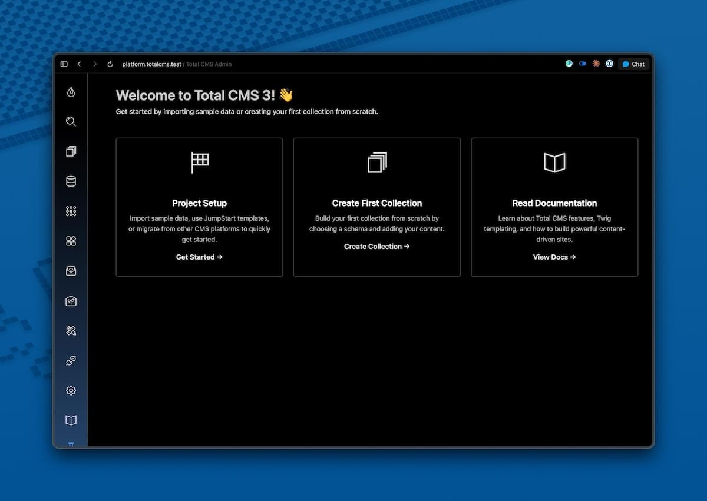
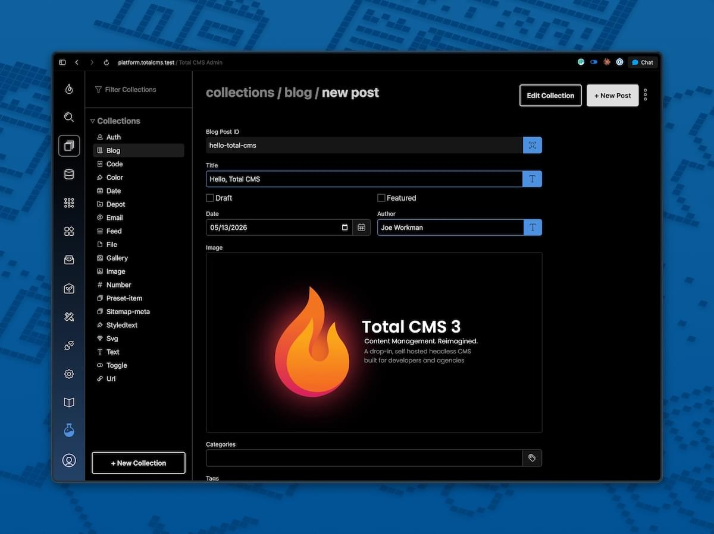
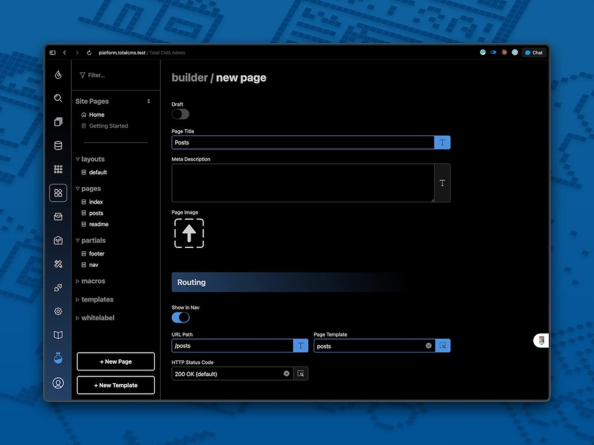
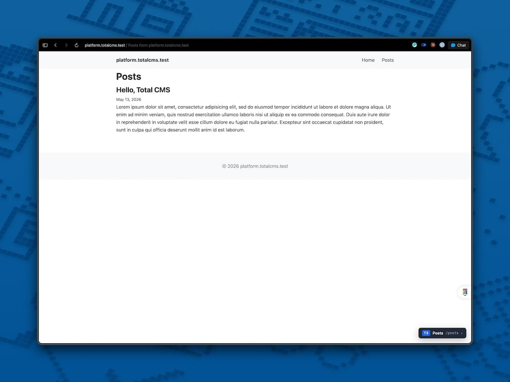

By the end of this page you'll have a real blog post rendering on a public URL — and the muscle memory for how Total CMS fits together. About **10 minutes** if you have Total CMS installed already; add a few more if you don't.

## Prerequisites

If Total CMS isn't installed yet, follow the [Installation](/get-started/installation/) guide first. When the wizard asks for a starter pack, the **minimal** starter is the cleanest base for this tutorial.

> Picked a different starter? Not a problem. The `blog`, `business`, and `portfolio` starters already include builder pages and templates — you can still follow along, but consider using a unique URL like `/posts` in step 4 so it doesn't collide with what's already there.

## 1. Open the admin

Visit your install URL and log in. You'll land on the dashboard.



The left sidebar holds your main navigation. Two icons we'll use today:

- **Collections** — your content (blog posts, images, products, anything)
- **Builder** — your Site Builder pages (URLs and templates)

## 2. Create your collections

A new install doesn't ship with content collections — you choose what you need. To get the standard ones in a single click, find the **Project Setup** link on the dashboard and open it.

Click **Setup Default Collections**. Total CMS creates the standard collections — `blog`, `gallery`, `image`, `file`, and more — each wired up with the matching schema. This process could take a little while.

> Already have collections from a starter pack (`blog`, `business`, `portfolio`)? You can skip this step. The collections you need already exist.

## 3. Add a blog post

Click **Collections** in the sidebar. You should now see `blog` in the list — click into it and hit **+ New Post**
button at the top.

Fill in:

| Field | Value |
|---|---|
| Title | `Hello, Total CMS` |
| Summary | A paragraph or two — whatever you like |
| Content | A paragraph or two — whatever you like |
| (rest) | Leave the defaults |

Click **Save** (or `cmd+S`). Your post lands in the collection's list.



You just created your first **object** — one record in the **blog** collection. The fields you filled in (title, content) are the object's **properties**, and the shape they conform to (which properties exist, what type each is) is defined by the blog **schema**.

## 4. Peek at the file on disk

There is no database. Your blog post is a file. Open `tcms-data/blog/` in your code editor and you'll find a JSON file named after your post's ID:

```json
{
  "id": "hello-total-cms",
  "title": "Hello, Total CMS",
  "body": "A paragraph or two — whatever you like",
  "date": "2026-05-13T14:23:00",
  "draft": false
}
```

This is what we mean by *flat-file*. Your content lives on disk as JSON — version-controllable, copy-able, scriptable. The admin is just a UI for editing these files.

## 5. Write the template

We have a post; now we need a URL where visitors can see it.

Click **Builder** in the sidebar and click on the **+ New Template** button. Use the following values:

| Field | Value |
|---|---|
| Type | `Page` |
| ID | `posts` |

Paste this into the code box:

```twig


Posts from {{ cms.config('domain') }}


    <h1>Posts</h1>
    
        <article>
            <h2>{{ post.title }}</h2>
            <p><small>{{ post.date | date('F j, Y') }}</small></p>
            <div>{{ post.summary }}</div>
        </article>
    

```

Save the template. The admin writes the file to disk for you.

> **Prefer your own code editor?** The template lives on disk at `tcms-data/builder/pages/posts.twig`. Open it in VS Code, vim, or whatever editor you like — Total CMS picks up changes from either place. The admin editor and the filesystem are the same file.


## 6. Add a page in Site Builder

Now click on the **+ New Page** at the bottom of the nav bar to create a page route for our template.

| Field | Value |
|---|---|
| Title | `Posts` |
| URL Path | `/posts` |
| Page Template | `pages/posts.twig` |

Save it.



The page record now exists in the `builder-pages` collection (yes, builder pages are themselves objects in a collection). The router will send any request for `/posts` to the page template that we created `pages/posts`.


## 7. View your site

Visit `/posts` on your install:



There's your blog post, rendered by your template, served by Site Builder.

Add another post in the admin and refresh — it appears at the top of the list without you touching the template. The template is general; the content is data.

## What just happened

In about 10 minutes you used every core piece of Total CMS:

| You did | What it's called |
|---|---|
| Ran Project Setup → Setup Default Collections | Created the standard **collections** + their **schemas** |
| Added a record in the admin | Created an **object** in the blog collection |
| Filled in fields | Set the object's **properties** |
| Saw the JSON file on disk | Saw flat-file storage in action |
| Created a `/posts` page in Builder | Routed a URL to a template via the **builder-pages** collection |
| Wrote a Twig template | Used `cms.collection.objects()` to fetch records and render them |

Everything else in Total CMS — custom fields, forms, auth, extensions, APIs — builds on these foundations.

## Where to next

- **[Site Builder Overview](/site-builder/overview/)** — page records, routes, templates in depth
- **[Twig Overview](/twig/overview/)** — the template engine and the `cms.*` API surface
- **[Collections](/twig/collections/)** — loading and filtering content in templates
- **[Collection Filtering](/twig/collection-filtering/)** — pagination, sorting, where-clauses for your post list
- **[Media](/twig/media/)** — adding images and image variants to your posts
- **[Schemas](/schemas/reference/)** — defining your own collection shapes (products, team members, anything)
